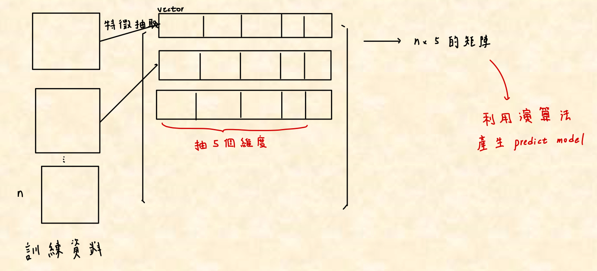

# Machine Learning

## Chap1 簡介

### Machine learning & AI & Deep learning
- Artificial Intelligence: Human Intelligence exhibited by machines
- Machine Learning: An approach to achieve Artificial Intelligence
    > 輸入大量訓練資料及對應標準答案，由computer自行找出規則，對世上某事情做決定or預測
- Deep Learning: A technique for implementing machine learning.
    > 強調使用連續、多層的方式自動得到更準確、有效的資料表示方式\
    > 網路:
    > 1. 計算機程序具有層次結構
    > 2. 每個級別的算法對輸入應用一個級別的轉換，並創建一個輸出模型作為輸出的參考
    > 3. 各種迭代背考慮在內，直到達到所需的精確度水平

### 機器學習
- 特徵抽取: 將資料轉換成高維空間的一個點
    > 辨異: 特徵表示(feature representation)
    > [參考資料](https://ai.stackexchange.com/questions/27996/where-do-the-feature-extraction-and-representation-learning-differ)
    > 1. 特徵表示為特徵抽取的一種，自動抽取特徵
    > 2. 此種方式抽取特徵的function必須抗干擾因子(Ex. 不是固定值，拍照遠近不會影響大小)
    > 3. 抽取特徵的function因應用領域(語意)不同而不同
    >   > 辨識不同物件都可以用的特徵: 一般化的特徵 (Ex. 線邊的抽取)

- 特徵空間: 特徵點展開的空間
    1. 可以以矩陣表示
    2. 特徵空間可以以演算法找到預測模型(predictive models)
        > 1. predictive models 即為分隔每個類別的線 (Ex. 貓的分類器)
        > 2. 多條線 -> 劃分多區塊的特徵空間(分割多類別)
        > 3. Good特徵抽取的特徵稱為 --- "高解析度能力(high discrimination)，即相似的物件在特徵空間上的距離，較不相似的近" -> 分類器越簡單
        > 4. 若一條線就可以分類資料稱為 --- "線性可分的分類器"
- 訓練(Training): 將Data標籤化(i.e 說這個Data是甚麼類別的)並建立predictive models
- 測試(Testing): 通常採取 outside testing
    > inside testing: 訓練資料與測試資料重複
    > outside testing: 反之
- 名詞
    - 語意: 即meta data，是對數據的一個說明(即為人的判斷)
        > 特徵空間的軸必須具有語意

### 深度學習
- 深度學習: 簡化特徵工程的難度，自動化產生特徵抽取的模型
- input 素材 + 答案，深度學習模型自動去調整，產生特徵抽取的模型
- 缺點: 
    1. 沒辦法完全掌握(黑盒子)
    2. 需要有能力架設自己的深度模型架構
- 深度學習為階層式的架構，某層input為上一層的output，層層迭代(模仿人類的思考模式，先學簡單的功能再組合，多層化完成高階或抽象的概念)

### Supervised Learning for Prediction
- 即會在Training Data給Label(是哪一類的正確答案的感覺)
- 相反的為: unsupervised learning
  
### Regression 迴歸分析
- 由data算出最小誤差的線(分布)

### Dimension Reduption
- 即為降維
- 後處理的技術
- 抽多個特徵，但有些不具語意能力(造成performence下降) -> 降維
- 應用example: 深度學習架設某層結構將資料降維

### Reinforcement Learning
- 為一種互動式的技術、為一種迭代式的學習(Iteractive Learning)，與AI最靠近的Machine Learning
- 知識會隨環境而變化
- 每次執行一次判斷，會有回饋，改善下次的判斷

### Patten classification Design Cycle
1. Data collection
2. Feature Choice
3. Model Choice(分類器要用哪個)
4. Training(訓練)
5. Evaluation(丟測試資料評估)
6. Computational Complexity(環境，應用是否適合 Ex. 要Real time嗎)
    
### Machine Learning 必須要有data
- Learning Features from rich data
- if 資料少可以採取此method
    > 先找類似應用的data預先訓練 -> 在轉移(用自己的data)

## Chap2 利用python做向量分析
- 基本概念
  > 

## Chap3 貝式定理回顧

## Chap4 監督式學習(Supervised Learning)
- 訓練資料有標記label(有標準答案) -> 演算法 -> 預測模型
- Instance-Based Classifiers
  - 分為兩種
    1. Rote-learner
       - 只有當unseen data的所有attributes吻合某一個training example時，判斷其為該類別
        > 53u 
    2. Nearest neighbor classifier 
       - "一筆unseen case透過自己的特徵值" 與 "每筆training records(instance)(每個特徵空間中的特徵點)算距離"，取最近的前幾名instance(最像的) -> 做決定

## Support vector machine
- 已經做特徵抽取後，而想在特徵空間上由Support vector machine找到分類邊界
  > 分類邊界又稱決策邊界(decision bonder)，可將點代入，if result  0: 則在線的右方，把此條線當作分類器
- 有多條決策邊界(都可以將training data類別分開)，哪一條比較好?
  > Support vector machine say:\
  > >算點到線的距離，選兩類最近靠近decision bonder的點(稱為Support vector支援向量: 用來定義邊界線的那些特徵向量)，劃出兩條與decision bonder平行但通過此點的邊界線，定義出兩條線之間的距離(margin，邊界的緩衝距離)
  >
  > 選margin最大的較佳，因為抽特徵值的時候，可能有誤差，會造成在特徵空間上的點有偏差，可能因為誤差跨過邊界，誤判為另一類

